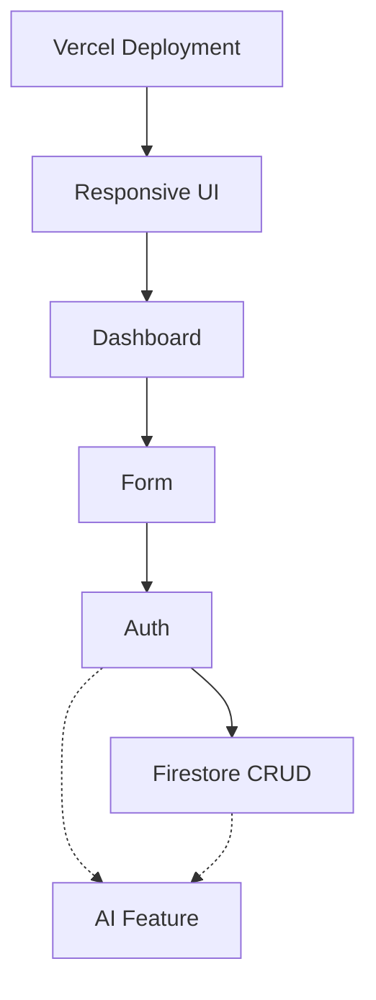

# 11_STARTER_KIT_ARCHITECTURE_V1.1.md

## 1. Starter Kit Philosophy

Starter Kits are NOT pre-built finished products. They are **ACCELERATORS**. 

Their primary purpose is to:
- Remove repetitive setup work.
- Reduce technical failure and configuration errors.
- Help beginners cross the "Rescue Lane" quickly.
- Allow teams to spend more time on product thinking rather than boilerplates.
- Preserve the learning experience without doing the work for them.
- Work naturally and predictably with Antigravity (AI).
- Reduce Firebase and Vercel debugging time.

A Starter Kit must **never** make the participant feel: *"I copied the answer."*
Instead, it should evoke: *"I used a proven building block and adapted it to my product."*

## 2. Design Principles

**IMPORTANT — DO NOT OVERBUILD.** 
Every Starter Kit must be intentionally small and solve one specific problem. We ask: *"What is the smallest reusable building block that reliably gets a beginner team unstuck?"*

**Optimize for:**
- Simplicity and Reliability
- Beginner accessibility
- AI-agent compatibility
- Fast recovery
- Easy deployment

**Avoid:**
- Unnecessary abstractions and excessive dependencies
- Enterprise-grade infrastructure or complicated state management
- Advanced, complex security systems that confuse beginners
- Unnecessary third-party libraries (e.g., heavy styling frameworks unless explicitly standard)
- Complex metaframeworks. **Do not use Next.js.**

**Core Bootcamp Tech Stack:**
- React (Frontend)
- TypeScript
- Firebase (Auth, Firestore, Cloud Functions)
- Vercel (Deployment)
- Antigravity (AI Builder)

## 3. Complete Starter Kit Catalog & Quality Tiers

**Tier A — Core** (Must exist for every cohort. Fundamental to the program.)
1. **01 — AUTH STARTER**
2. **02 — FIRESTORE CRUD STARTER**
3. **07 — VERCEL DEPLOYMENT STARTER**

**Tier B — Accelerator** (Recommended when relevant. Highly useful but optional depending on product.)
4. **03 — DASHBOARD STARTER**
5. **04 — FORM STARTER**
6. **05 — AI FEATURE STARTER**
7. **06 — RESPONSIVE UI STARTER**

**Tier C — Experimental** (Not allowed in the main bootcamp unless validated in a pilot run.)
*(None currently defined)*

## 4. Starter Kit Selection Decision Tree

Participants should only use a kit when it reduces complexity. The goal is: **Don't use a Starter Kit just because it exists.**

*   Does the product need a live public URL?
    *   → **Yes:** Use Vercel Deployment Starter (Mandatory Day 1)
*   Does the product need authentication to function?
    *   → **Yes:** Use Auth Starter
*   Does the product need persistent, user-generated data?
    *   → **Yes:** Use Firestore CRUD Starter
*   Does the product use AI features (generation, summarization, etc.)?
    *   → **Yes:** Use AI Feature Starter
*   Does the product need a standard navigation and layout shell?
    *   → **Yes:** Use Dashboard Starter
*   Does the product need complex user input validation?
    *   → **Yes:** Use Form Starter
*   Are you struggling with a layout breaking on mobile?
    *   → **Yes:** Use Responsive UI Starter

## 5. Dependency Graph & Golden Path

**The Golden Path:**
This is the one canonical combination that mentors can support easily. It is the default supported path. Teams may deviate when necessary, but this is the safest route for a beginner:

`Vercel → Responsive UI → Dashboard → Form → Auth → Firestore → AI Feature`

**Architectural Dependency Graph:**
This map shows how the kits relate. It is not a rigid participant path, but a guide for integration.


*(Note: AI Feature can technically run independently if anonymous, but normally integrates alongside Auth/Firestore)*

## 6. Starter Kit Compatibility Matrix

| Kit | Firebase Dep? | Auth Dep? | Vercel Dep? | AI Dep? | Required Prior Kits | Optional Deps | Works Independently? |
| :--- | :--- | :--- | :--- | :--- | :--- | :--- | :--- |
| **01 Auth** | Yes (Auth) | - | Yes | No | Vercel | Responsive UI | Yes |
| **02 Firestore** | Yes (Firestore) | Yes | Yes | No | Vercel, Auth | Form | No |
| **03 Dashboard** | No | No | Yes | No | Vercel | Responsive UI | Yes |
| **04 Form** | No | No | Yes | No | Vercel | - | Yes |
| **05 AI Feature**| Yes (Functions)| No | Yes | Yes | Vercel | Auth, Firestore | Yes |
| **06 Responsive UI**| No | No | Yes | No | Vercel | - | Yes |
| **07 Vercel Deploy**| No | No | - | No | None | - | Yes |

## 7. Folder Structure & Standard Kit Contract

Kits use a flat structure. Not every kit needs hooks or components—code/configuration should only exist when explicitly required.

Every Starter Kit **MUST** contain the following Standard Kit Contract:
- `README.md` (Quick start, when to use, how to customize)
- `KIT_SPEC.md` (Technical specification for Antigravity integration)
- `TEST_CHECKLIST.md` (Manual verification steps)
- `MENTOR_NOTES.md` (Expected failure modes, Rescue procedures)
- `VERSION.md` (Compatibility mapping)

Example Layout:
```text
starter-kits/
  ├── 01-auth-starter/
  │   ├── README.md
  │   ├── KIT_SPEC.md
  │   ├── TEST_CHECKLIST.md
  │   ├── MENTOR_NOTES.md
  │   ├── VERSION.md
  │   └── [Code files...]
  └── ...
```

## 8. Starter Kit Integrity Rule

**Participants MAY modify:**
- UI components and styles
- Text labels and copy
- Data models and schemas
- Prompts (for AI)
- Business logic

**Participants must NOT casually modify (unless supervised by a mentor):**
- Security architecture (Firestore rules, backend validation)
- Secret handling (Env vars structure, exposing keys)
- Core Firebase initialization
- Deployment configuration (`vercel.json`, build commands)

## 9. Security Principles & AI Feature Security

**AI Feature Security is Paramount.**
- **NO API keys in frontend code.** Under no circumstances should Gemini or OpenAI keys be sent to the browser.
- **NO NEXT_PUBLIC-style exposure.** Any variable meant to be secret must never be prefixed with a frontend exposure tag (e.g., `VITE_`, `REACT_APP_`, `NEXT_PUBLIC_`).
- **AI secrets live server-side.** They belong only in the Firebase Cloud Function environment.
- **Firebase Cloud Functions handle AI requests.** The frontend React app securely calls a Firebase Cloud Function (preferably `onCall` which passes Auth state implicitly), and the Cloud Function securely holds the API key and communicates with the Gemini API.

**Firestore Security Defaults:**
- **NO open/test mode rules.** All Firebase Starter Kits must use secure, beginner-friendly defaults right out of the box.
- Firestore should default to authenticated access, specifically user-scoped isolation.
- Example structure enforced by rules: `users/{userId}/items/{itemId}`.
- Participants must understand that by default, a user can only read and write their own data.

## 10. Individual Kit Specifications

### 01 — AUTH STARTER
- **Purpose:** Provide the minimum reliable authentication flow (Sign Up / Login → Authenticated State → Logout).
- **When to use:** When user identity is required.
- **When NOT to use:** If the app works perfectly fine anonymously.
- **Included:** Firebase client config, simple auth context/hook, Login/Signup UI, Protected Route wrapper.
- **Must understand:** How Firebase holds the session.
- **Timing Expectation:** Standard (15–30 min).
- **Rescue Lane:** If blocked and cannot resolve, **do not bypass with hardcoded users.** Reduce scope: remove Auth entirely, continue with an anonymous/local MVP, and ship the core user flow.

### 02 — FIRESTORE CRUD STARTER
- **Purpose:** Establish the minimum useful data loop (Create → Firestore → Read).
- **When to use:** To save user-generated content across sessions.
- **When NOT to use:** Static data or single-session local state.
- **Included:** Configured DB instance, generic user-scoped collection (`users/{userId}/items`), secure Firestore rules.
- **Must understand:** The `userId` pathing and user-isolated data storage.
- **Timing Expectation:** Standard (15–30 min).

### 03 — DASHBOARD STARTER
- **Purpose:** Provide a reusable dashboard structure with basic layout semantics.
- **When to use:** When the app needs a home base for authenticated users.
- **When NOT to use:** Single-page landing sites.
- **Included:** Page shell, sidebar/top nav, summary cards, empty/loading/error states.
- **Timing Expectation:** Quick Win (5–15 min).

### 04 — FORM STARTER
- **Purpose:** Create a reusable, controlled form pattern.
- **When to use:** For robust user input with validation.
- **When NOT to use:** For a single, simple text input (like a basic search bar).
- **Included:** Controlled fields, validation logic, loading state, success/error feedback.
- **Timing Expectation:** Quick Win (5–15 min).

### 05 — AI FEATURE STARTER
- **Purpose:** Demonstrate a secure pattern for calling AI APIs (Text generation, classification, etc.).
- **When to use:** To implement the core AI value proposition.
- **When NOT to use:** If the app has no generative AI features.
- **Included:** React Frontend request UI → Firebase Cloud Function template → Gemini API integration.
- **Must understand:** Separation of client (UI) and server (Cloud Functions, secrets).
- **Timing Expectation:** Complex (30–45 min).
- **Mentor Verification:** Absolute zero tolerance for API keys in the frontend bundle.

### 06 — RESPONSIVE UI STARTER
- **Purpose:** Provide a minimal, "SHIP UGLY" responsive foundation.
- **When to use:** To prevent broken layouts on mobile.
- **When NOT to use:** If the team is highly proficient in CSS or using a robust UI library.
- **Included:** Mobile-first layout container, flexbox utilities.
- **Timing Expectation:** Quick Win (5–15 min).

### 07 — VERCEL DEPLOYMENT STARTER
- **Purpose:** Ensure predictable, instant deployment for the Day 1 "Ghost Deploy".
- **When to use:** Day 1. Mandatory for all teams.
- **When NOT to use:** Never.
- **Included:** Build command verification, env var checklist.
- **Timing Expectation:** Quick Win (5–15 min).

## 11. Testing Layers & Timing Expectations

**Timing Expectations:**
Do not require every Starter Kit to be completed in a rigid 20 minutes. Instead:
- **Quick Win:** 5–15 min (e.g., Responsive UI, Vercel, Dashboard, Form)
- **Standard:** 15–30 min (e.g., Auth, Firestore CRUD)
- **Complex:** 30–45 min (e.g., AI Feature)

**Testing Layers:**
Before a Starter Kit is considered valid for the bootcamp, it must pass:
1. **Unit/Component Test:** Code compiles without type errors; individual functions execute.
2. **Integration Test:** Kits work together (e.g., Form Starter submits properly to Firestore Starter).
3. **Fresh Project Test:** Kit can be dropped into a completely blank React/Firebase project and work.
4. **Antigravity Agent Test:** The AI can read the `KIT_SPEC.md` and successfully implement it from a prompt.
5. **Vercel Deployment Test:** The kit builds and runs in the Vercel production environment.
6. **Beginner Usability Test:** Can a beginner follow the documentation and successfully integrate the kit *without mentor intervention* within the expected time bracket?

## 12. Failure Recovery & Rescue Lane

Standardized Starter Kit Rescue:
- **Participant Attempt:** Participant tries using Kit docs and Agent.
- **Escalation:** If stuck beyond a reasonable time (15 mins of pure frustration), call Mentor.
- **Scope Reduction over Insecurity:** 
  - E.g., Auth blocked? Do not bypass authentication with hardcoded users. Drop Auth from the MVP, switch to local/anonymous data, and keep moving. Scope reduction is always preferred over broken or insecure architecture.

## 13. Maintenance & Definition of Done

**Maintenance Strategy:**
Starter kits are reviewed after every cohort. If a kit repeatedly causes teams to enter the Rescue Lane, it is marked for mandatory refactoring.

**Definition of Done for the Starter Kit System:**
The architecture is complete when all 7 kits exist, have Tier assignments, pass all 6 Testing Layers, contain the 5-file Standard Kit Contract, enforce the Integrity Rules, and execute flawlessly on the Golden Path via Antigravity.

---

# FINAL ARCHITECTURE LOCK

**NON-NEGOTIABLE RULES:**
1. **No Next.js.** The stack is strictly React + Firebase Cloud Functions + Vercel.
2. **Secure Defaults Only.** No open/test mode Firestore rules. Use `users/{userId}/...`.
3. **No Key Leaks.** AI API keys must exist *only* in Firebase Cloud Functions.
4. **No Mock Users.** If Auth fails, reduce scope to anonymous MVP. Do not hardcode users.
5. **Enforce the Standard Contract.** Every kit must have `README.md`, `KIT_SPEC.md`, `TEST_CHECKLIST.md`, `MENTOR_NOTES.md`, and `VERSION.md`.
6. **Code is an Accelerator.** Focus on solving one specific problem per kit, keeping it intentionally small and beginner-friendly.
