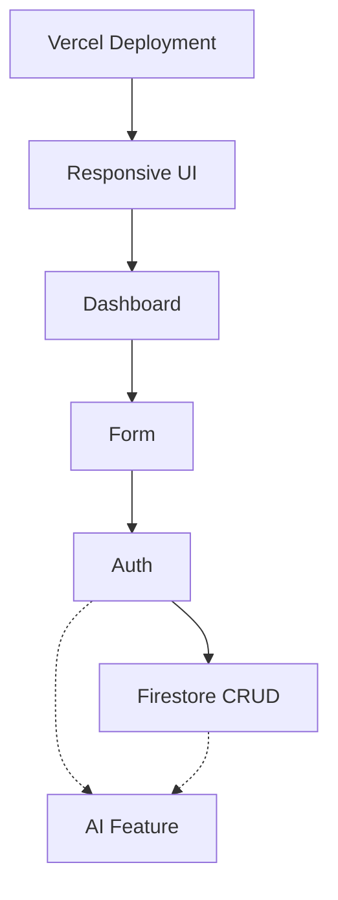

# 11_STARTER_KIT_ARCHITECTURE_V1.2.md

## 1. Starter Kit Philosophy

Starter Kits are NOT pre-built finished products. They are **ACCELERATORS**. 

Their primary purpose is to:
- Remove repetitive setup work.
- Reduce technical failure and configuration errors.
- Help beginners cross the "Rescue Lane" quickly.
- Allow teams to spend more time on product thinking rather than boilerplates.
- Preserve the learning experience without doing the work for them.
- Work naturally and predictably with Antigravity (AI).
- Reduce Firebase and Vercel debugging time.

A Starter Kit must **never** make the participant feel: *"I copied the answer."*
Instead, it should evoke: *"I used a proven building block and adapted it to my product."*

**Canonical Program Philosophy:**
"Build the smallest working version of your product."
The program does NOT explicitly mandate: "Build a web application." The implementation surface is a means, not the learning objective.

## 2. Design Principles

**IMPORTANT — DO NOT OVERBUILD.** 
Every Starter Kit must be intentionally small and solve one specific problem. We ask: *"What is the smallest reusable building block that reliably gets a beginner team unstuck?"*

**Optimize for:**
- Simplicity and Reliability
- Beginner accessibility
- AI-agent compatibility
- Fast recovery
- Easy deployment

**Avoid:**
- Unnecessary abstractions and excessive dependencies
- Enterprise-grade infrastructure or complicated state management
- Advanced, complex security systems that confuse beginners
- Unnecessary third-party libraries
- Complex metaframeworks. **Do not use Next.js.**

**Core Bootcamp Tech Stack:**
- React (Frontend)
- TypeScript
- Firebase (Auth, Firestore, Cloud Functions)
- Vercel (Web Deployment)
- Antigravity (AI Builder)

## 3. Product Architecture vs. Build Surface

The bootcamp strictly separates **PRODUCT ARCHITECTURE** from **IMPLEMENTATION SURFACE**.
The participant's goal is to build a working MVP. The MVP may live on the Web, Mobile, PWA, or another reasonable client surface.
The bootcamp evaluates the product outcome and the Core User Flow, not a specific UI platform.

## 4. Supported Build Surfaces

**CORE (Fully Supported):**
- Responsive Web App
- Mobile Web / PWA

**EXPERIMENTAL (Allowed but risky):**
- React Native / Expo

**NOT OFFICIALLY SUPPORTED:**
- Native Android
- Native iOS
- Flutter
- Other frameworks

*Note: "Not officially supported" does NOT mean participants are forbidden from using them. It means there is no guaranteed Starter Kit support, no guaranteed mentor expertise, no guaranteed debugging path, and the team accepts additional technical risk.*

## 5. Mobile & Experimental Path Policy

**Mobile Risk Rule:**
"Choose the simplest surface that allows the team to prove the core user flow."
If mobile adds unnecessary technical complexity, the team must switch to PWA/Web. The objective is to prove the product, not to prove mobile engineering skill.

**Checkpoint Requirement:**
If a participant chooses the React Native / Expo experimental path, they must pass a technical checkpoint BEFORE committing to the path for the remainder of the bootcamp:
1. Can the project run locally?
2. Can the team produce a working screen?
3. Can Firebase connect successfully?
4. Can the core user flow run?
5. Can the team demonstrate the app on a real device or emulator?

**Consequence:** If they fail this checkpoint, the team must immediately switch to the Core Web/PWA path. This is a risk-control mechanism to ensure they finish by Demo Day, not a punishment.

## 6. Complete Starter Kit Catalog, Quality Tiers, & Surface Types

Starter Kits are now classified as either **SURFACE-AGNOSTIC** (logical, data, backend) or **SURFACE-SPECIFIC** (UI, layout, deployment).

**Tier A — Core** (Must exist for every cohort.)
1. **01 — AUTH STARTER** *(Surface-Agnostic)*
2. **02 — FIRESTORE CRUD STARTER** *(Surface-Agnostic)*
3. **07 — VERCEL DEPLOYMENT STARTER** *(Surface-Specific: Web/PWA)*

**Tier B — Accelerator** (Recommended when relevant.)
4. **03 — DASHBOARD STARTER** *(Surface-Specific: Web/PWA)*
5. **04 — FORM STARTER** *(Surface-Specific: Web/PWA)*
6. **05 — AI FEATURE STARTER** *(Surface-Agnostic backend, Surface-Specific frontend)*
7. **06 — RESPONSIVE UI STARTER** *(Surface-Specific: Web/PWA)*

**Tier C — Experimental** (Not allowed in main bootcamp unless validated.)
8. **08 — EXPO MOBILE STARTER** *(Surface-Specific: Expo - Future Architecture Only)*

## 7. Starter Kit Selection Decision Tree

Participants should only use a kit when it reduces complexity. The goal is: **Don't use a Starter Kit just because it exists.**

*   Does the product need authentication to function?
    *   → **Yes:** Use Auth Starter
*   Does the product need persistent, user-generated data?
    *   → **Yes:** Use Firestore CRUD Starter
*   Does the product use AI features (generation, summarization, etc.)?
    *   → **Yes:** Use AI Feature Starter
*   Is the team building a Web/PWA MVP?
    *   → **Yes:** Use Vercel Deployment Starter (Mandatory Day 1)
    *   → **Yes:** Use Dashboard, Form, or Responsive UI Starters as needed.
*   Is the team building an Expo mobile MVP?
    *   → **Yes:** Complete the Experimental Checkpoint. Do NOT use Web UI starters.

## 8. Dependency Graph & The Golden Paths

The Golden Path does not imply Vercel is mandatory for every product. Instead, the path is defined by layers:

`PRODUCT LAYER → CLIENT SURFACE → BACKEND / DATA → AI SERVICES → DEPLOYMENT`

**Core Web Golden Path:**
`React/TS → Firebase → AI Cloud Function → Vercel`
*Supported by: Vercel Deploy → Responsive UI → Dashboard → Form → Auth → Firestore → AI Feature*

**Mobile/Expo Experimental Path:**
`React Native/Expo → Firebase → AI Cloud Function → Mobile Testing Path (Expo Go/EAS)`
*Supported by: Auth → Firestore → AI Feature (Backend). (Mobile UI kits are not currently provided).*

**Architectural Dependency Graph (Core Web):**


## 9. Starter Kit Compatibility Matrix

| Kit | Firebase Dep? | Auth Dep? | AI Dep? | Web | PWA | Expo | Works Independently? |
| :--- | :--- | :--- | :--- | :--- | :--- | :--- | :--- |
| **01 Auth** | Yes (Auth) | - | No | ✓ | ✓ | ✓ | Yes |
| **02 Firestore** | Yes (Firestore) | Yes | No | ✓ | ✓ | ✓ | No |
| **03 Dashboard** | No | No | No | ✓ | ✓ | — | Yes |
| **04 Form** | No | No | No | ✓ | ✓ | — | Yes |
| **05 AI Feature**| Yes (Functions)| No | Yes | ✓ | ✓ | ✓ | Yes |
| **06 Responsive UI**| No | No | No | ✓ | ✓ | — | Yes |
| **07 Vercel Deploy**| No | No | No | ✓ | ✓ | — | Yes |
| *(Future)* Expo UI| No | No | No | — | — | ✓ | Yes |

## 10. Folder Structure & Standard Kit Contract

Kits use a flat structure. Not every kit needs hooks or components—code/configuration should only exist when explicitly required.

Every Starter Kit **MUST** contain the following Standard Kit Contract:
- `README.md` (Quick start, when to use, how to customize)
- `KIT_SPEC.md` (Technical specification for Antigravity integration)
- `TEST_CHECKLIST.md` (Manual verification steps)
- `MENTOR_NOTES.md` (Expected failure modes, Rescue procedures)
- `VERSION.md` (Compatibility mapping)

Example Layout:
```text
starter-kits/
  ├── 01-auth-starter/
  │   ├── README.md
  │   ├── KIT_SPEC.md
  │   ├── TEST_CHECKLIST.md
  │   ├── MENTOR_NOTES.md
  │   ├── VERSION.md
  │   └── [Code files...]
  └── ...
```

## 11. Starter Kit Integrity Rule

**Participants MAY modify:**
- UI components and styles
- Text labels and copy
- Data models and schemas
- Prompts (for AI)
- Business logic

**Participants must NOT casually modify (unless supervised by a mentor):**
- Security architecture (Firestore rules, backend validation)
- Secret handling (Env vars structure, exposing keys)
- Core Firebase initialization
- Deployment configuration (`vercel.json`, build commands)

## 12. Security Principles & AI Feature Security

**AI Feature Security is Paramount.**
- **NO API keys in frontend code.** Under no circumstances should Gemini or OpenAI keys be sent to the browser/client.
- **NO NEXT_PUBLIC-style exposure.** Any variable meant to be secret must never be prefixed with a frontend exposure tag (e.g., `VITE_`, `REACT_APP_`, `NEXT_PUBLIC_`, `EXPO_PUBLIC_`).
- **AI secrets live server-side.** They belong only in the Firebase Cloud Function environment.
- **Firebase Cloud Functions handle AI requests.** The frontend client securely calls a Firebase Cloud Function (preferably `onCall` which passes Auth state implicitly), and the Cloud Function securely holds the API key and communicates with the Gemini API.

**Firestore Security Defaults:**
- **NO open/test mode rules.** All Firebase Starter Kits must use secure, beginner-friendly defaults right out of the box.
- Firestore should default to authenticated access, specifically user-scoped isolation.
- Example structure enforced by rules: `users/{userId}/items/{itemId}`.
- Participants must understand that by default, a user can only read and write their own data.

## 13. Individual Kit Specifications

### 01 — AUTH STARTER
- **Purpose:** Provide the minimum reliable authentication flow.
- **When to use:** When user identity is required.
- **Rescue Lane:** If blocked and cannot resolve, **do not bypass with hardcoded users.** Reduce scope: remove Auth entirely, continue with an anonymous/local MVP.

### 02 — FIRESTORE CRUD STARTER
- **Purpose:** Establish the minimum useful data loop.
- **Included:** Configured DB instance, generic user-scoped collection (`users/{userId}/items`), secure Firestore rules.

### 03 — DASHBOARD STARTER (Web-Only)
- **Purpose:** Provide a reusable dashboard structure with basic layout semantics for Web/PWA.
- **Included:** Page shell, sidebar/top nav, summary cards, empty/loading/error states.

### 04 — FORM STARTER (Web-Only)
- **Purpose:** Create a reusable, controlled form pattern.
- **Included:** Controlled fields, validation logic, loading state, success/error feedback.

### 05 — AI FEATURE STARTER
- **Purpose:** Demonstrate a secure pattern for calling AI APIs (Text generation, classification, etc.).
- **Included:** Client request UI → Firebase Cloud Function template → Gemini API integration.
- **Mentor Verification:** Absolute zero tolerance for API keys in the client bundle.

### 06 — RESPONSIVE UI STARTER (Web-Only)
- **Purpose:** Provide a minimal, "SHIP UGLY" responsive foundation.
- **Included:** Mobile-first layout container, flexbox utilities.

### 07 — VERCEL DEPLOYMENT STARTER (Web-Only)
- **Purpose:** Ensure predictable, instant deployment for the Day 1 "Ghost Deploy".
- **Included:** Build command verification, env var checklist.

## 14. Testing Layers & Timing Expectations

**Timing Expectations:**
- **Quick Win:** 5–15 min (e.g., Responsive UI, Vercel, Dashboard, Form)
- **Standard:** 15–30 min (e.g., Auth, Firestore CRUD)
- **Complex:** 30–45 min (e.g., AI Feature)

**Testing Layers:**
Before a Starter Kit is considered valid for the bootcamp, it must pass Unit/Component Tests, Integration Tests, Fresh Project Tests, Antigravity Agent Tests, Deployment Tests, and Beginner Usability Tests.

## 15. Demo Day Compatibility

A mobile product must be judged fairly against web products. The scoring remains focused purely on the product architecture:
- Problem
- Core User Flow
- Execution
- AI Integration
- Pitch
**Do NOT introduce platform-specific scoring.**

Demo requirements for mobile or experimental surfaces should fully support:
- Live mobile demo from a real device
- Emulator demo running on screen
- Screen recording fallback (for network safety)
- QR code for judges to test directly on their phones when appropriate

## 16. Failure Recovery & Rescue Lane

Standardized Starter Kit Rescue:
- **Participant Attempt:** Participant tries using Kit docs and Agent.
- **Escalation:** If stuck beyond a reasonable time (15 mins), call Mentor.
- **Scope Reduction over Insecurity:** 
  - E.g., Auth blocked? Do not bypass authentication with hardcoded users. Drop Auth from the MVP, switch to local/anonymous data, and keep moving. Scope reduction is always preferred over broken or insecure architecture.

## 17. Maintenance & Definition of Done

**Maintenance Strategy:**
Starter kits are reviewed after every cohort. If a kit repeatedly causes teams to enter the Rescue Lane, it is marked for mandatory refactoring.

**Definition of Done for the Starter Kit System:**
The architecture is complete when all core kits exist, have Tier assignments, pass all Testing Layers, contain the Standard Kit Contract, enforce the Integrity Rules, and execute flawlessly on their respective paths via Antigravity.

---

# FINAL ARCHITECTURE LOCK

**NON-NEGOTIABLE RULES:**
1. **Surface Independence.** The learning objective is building the MVP, not the implementation surface. "Build the smallest working version of your product."
2. **Mobile Risk Control.** Teams choosing Expo/React Native must pass a technical checkpoint early. If they fail, they must switch back to the Core Web/PWA path to ensure Demo Day success.
3. **No Next.js.** The web stack is strictly React + Firebase Cloud Functions + Vercel.
4. **Secure Defaults Only.** No open/test mode Firestore rules. Use `users/{userId}/...`.
5. **No Key Leaks.** AI API keys must exist *only* in Firebase Cloud Functions. Never on the frontend or mobile client.
6. **No Mock Users.** If Auth fails, reduce scope to anonymous MVP. Do not hardcode users.
7. **Enforce the Standard Contract.** Every kit must have `README.md`, `KIT_SPEC.md`, `TEST_CHECKLIST.md`, `MENTOR_NOTES.md`, and `VERSION.md`.
